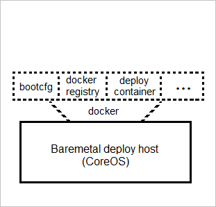
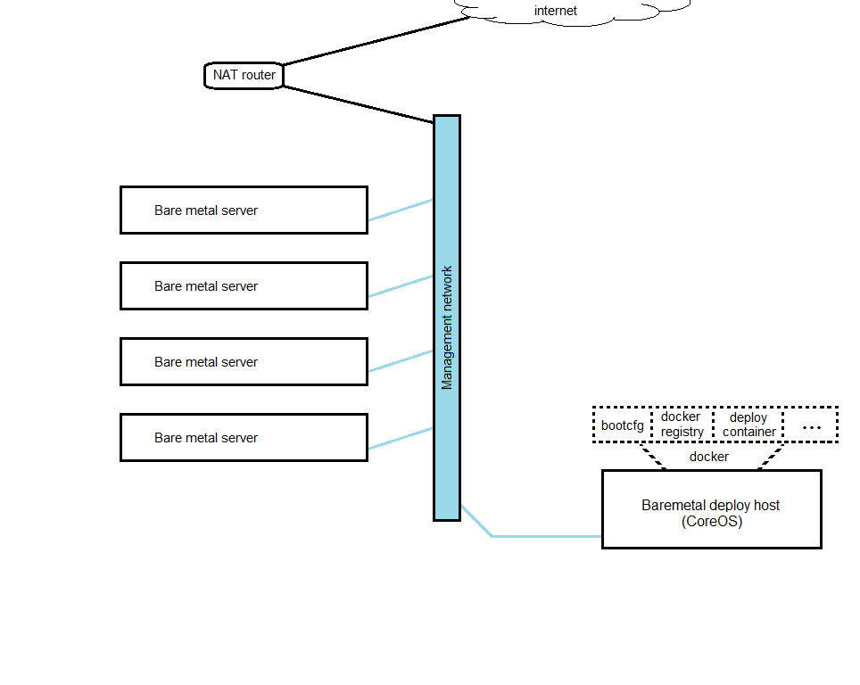
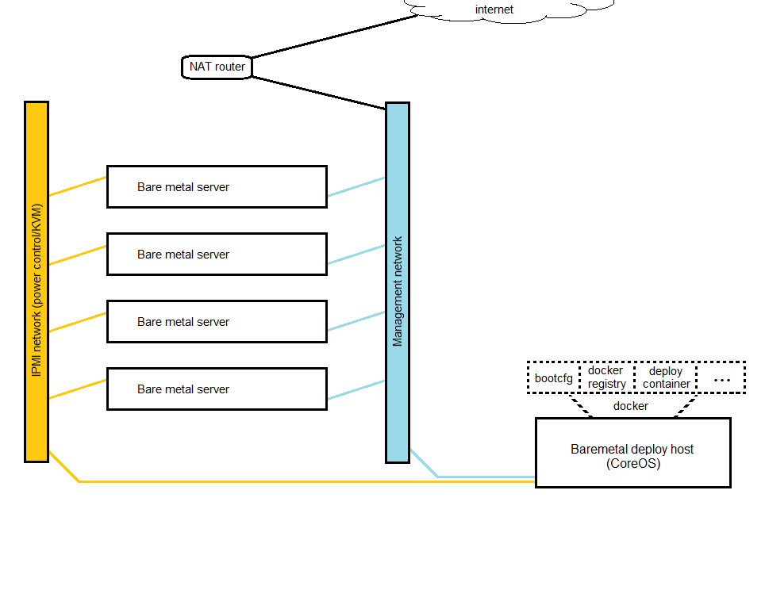
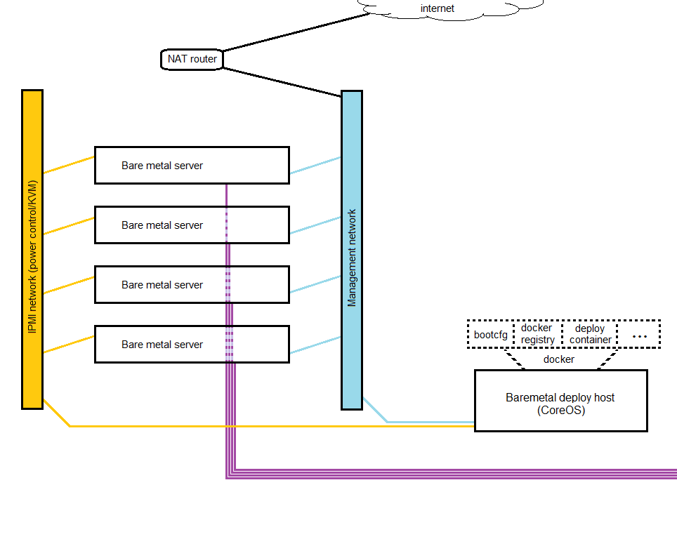

# KPC - OpenStack Kolla on PXE-booted CoreOS

### Deployment layout and supporting infrastructure
These instructions describe deploying Kolla to baremetal hosts running CoreOS, which have been PXE-booted from another CoreOS host (the deploy host).



Most of the required supporting infrastructure (CoreOS's "bootcfg" network boot service, private Docker registry, etc.) are run inside docker containers on the deploy host, including kolla-ansible. The deploy host is not technically part of the deployment and can be shut down once it is completed. However, it should be preserved in case it is needed later for running Kolla upgrades or reconfigurations.

The deploy host runs several containerized services:
 - An instance of [CoreOS's bootcfg service](https://github.com/coreos/coreos-baremetal/blob/master/Documentation/bootcfg.md):
   - "bootcfg is an HTTP and gRPC service that renders signed Ignition configs, cloud-configs, network boot configs, and metadata to machines to create CoreOS clusters."
 - An instance of CoreOS's dnsmasq container
   - This documentation deploys this service such that it will co-exist with an existing DHCP server which is not serving any PXE options. This is referred to as proxy DHCP: "A proxy DHCP server is defined by the PXE specification as a server which sends auxiliary boot information to clients, like the boot filename, tftp server or rootpath, but leaves the task of IP leasing to the normal DHCP server."
   - The PXE options this dnsmasq service provides point to the "bootcfg" endpoint mentioned above. [The container's documentation](https://github.com/coreos/coreos-baremetal/tree/master/contrib/dnsmasq) and the [coreos-baremetal documentation](https://github.com/coreos/coreos-baremetal/blob/master/Documentation/network-setup.md#proxy-dhcp) have more information on this as well as other operating modes (no existing DHCP, existing reconfigurable DHCP, etc.).
 - Run interactively, is a container for executing kolla-ansible, build.py, etc. This documentation refers to this as the deploy container, which is running on the deploy host. Although this function is typically performed on the deploy host when using Kolla, it is typically run directly on the deploy host and not containerized.

### Layout of the physical network
The vlan terminology used here is described in terms of "vlan is untagged for port" and/or "vlan is tagged for port(s)". This terminology is common on many vendor's hardware such as D-Link and Netgear, and even some midrange Cisco Business switches. It is assumed that anyone using the (arguably more traditional) access/trunk terminology will translate this reference layout to their environment.

**1. A vlan for management network**
  - This network has Internet access behind a NAT router.
  - The IP addresses for the hosts in Ansible's inventory are in this network, and Kolla's management VIP is also chosen as an unused IP in this network (config option: 'kolla_internal_vip_address').
  - The NAT router handles DHCP on this network, though some devices like switches may be statically assigned if desired.


**2. A vlan for IPMI network.**
  - If your hosts have dedicated IPMI NICs, the ports they plug into are untagged on the switch for this network.
  - If your hosts have shared IPMI NICs, the ports they plug into are untagged for the NIC's primary function and the IPMI cards should have that vlan id set in their configs.
  - Other ports are set as tagged for this network as-needed (such as the uplink to the NAT router).
  - DHCP for the IPMI network is provided by the NAT router (the existing test setup runs the DHCP server on a vlan interface added to the router for this network, so you may need more than a SOHO router to do this - Mikrotik RB450G in use here.)


**3. External/provider network access**
  - At least one NIC on each host is configured to be used for external/provider network access (config option: 'kolla_external_vip_interface').



### Deploy host install

Get deploy host running on CoreOS that has been installed to disk.
Recommended procedure:  
  - Download the CoreOS ISO and copy to USB flash drive with 'dd' or one of the many generic ISO to USB helper tools (Rufus [highly recommended on Windows], UNetbootin, Universal USB Installer, etc.).
    - **IMPORTANT**: The CoreOS version and release channel of the ISO used to boot the deploy host will be the version and channel used on the nodes. Overrides for this may be added at a later date.
  - Set deployer node to boot from the disk you will install to, then perform a one-time boot from the flash drive to bring up a live-booted (to RAM) CoreOS system and automatically log you in as '**core**'.
  - Set a password for the **core** user:  
    ```
    sudo passwd core
    ```
  - Note the IP the system gets, as we will SSH to the host in next steps:  
    ```
    ip a
    ```
  - SSH to the host from your machine, logging in as **core** using the password you just set
  - Create a cloud-init or ignition config that sets an SSH key for **core** and sets Docker to use an insecure registry. We will pass this file to `coreos-install` to use while installing the OS to disk. The IP or hostname of the insecure registry must be the actual location you intend to use (FIXME: add a note that what you put here in the end will point at THIS host - the deployer), but the private Docker Registry does not have to be running yet.  
    ```
    cd && vim cloud-config.yaml
    ```
    Contents:
    ```
    #cloud-config
    
    ssh_authorized_keys:
      - ssh-rsa AAAAB3NzaC1yc2EAAAADAQABAAABAQDGdByTgSVHq.......
    
    manage_etc_hosts: localhost
    
    coreos:
      units:
        - name: docker.service
          drop-ins:
            - name: 50-insecure-registry.conf
              content: |
                [Service]
                Environment='DOCKER_OPTS=--insecure-registry="10.101.0.15:5000"'
          command: restart
    ```  
  - Find the device name of the disk you set the deployer to boot to, using `sudo fdisk -l` or similar. The example coreos-install command below assumes you found this device at '/dev/sda'.
  - If you need to configure a static DHCP lease in your router for your deployer node this is a good time to do it, so that you get the new IP when the system reboots.
  - Run coreos-install to install to disk:

    ```
    sudo coreos-install -d /dev/sda -C stable -c ~/cloud-config.yaml
    sudo reboot
    ```

  - Check out this repo:

    ```
    git clone https://github.com/ropsoft/KPC.git
    ```

  - Build container with IPMI tools:

    ```
    cd KPC/dockerfiles/
    docker build -t ipmitools ipmitools/
    cd ..
    ```

  - Export environment vars to configure, and substitute those vars in

    ```
    # what channel to deploy to nodes
    export KPC_coreos_channel=stable
    find ./ -type f -exec sed -i -e "s/KPC_coreos_channel/${KPC_coreos_channel}/" {} \;
    
    # what version within chosen channel
    export KPC_coreos_version='1010.5.0'
    find ./ -type f -exec sed -i -e "s/KPC_coreos_version/${KPC_coreos_version}/" {} \;
    
    # used both as-named and for image base url option of coreos-install
    export KPC_bootcfg_endpoint='10.101.0.15'
    find ./ -type f -exec sed -i -e "s/KPC_bootcfg_endpoint/${KPC_bootcfg_endpoint}/" {} \;

    # with a little trial and error you should be able to pass a list if you want
    export KPC_ssh_authorized_keys='ssh-rsa AAAAB3NzaC1yc2EAAAADAQABAAABAQDGdByTgSVHq.......'
    # sed delimiter changed to avoid escaping '/'
    find ./ -type f -exec sed -i -e "s|KPC_ssh_authorized_keys|${KPC_ssh_authorized_keys}|" {} \;

    # create a token to bootstrap etcd - remember to set size to the number of target nodes
    export KPC_discovery_token="$(curl -w "\n" 'https://discovery.etcd.io/new?size=3')"
    # sed delimiter changed to avoid escaping '/'
    find ./ -type f -exec sed -i -e "s|KPC_discovery_token|${KPC_discovery_token}|" {} \;

    # a hint on how to find which IP etcd should use for some options
    # NOTE: This ends up used as regex; periods are not literal. This is lesser evil than esacping them here.
    # Should be ok as long as no two are adjacent for some reason, like "10..10.0."
    # (i.e.: the single character they match should always be a literal '.')
    export KPC_private_subnet_hint="10.101.0."
    find ./ -type f -exec sed -i -e "s/KPC_private_subnet_hint/${KPC_private_subnet_hint}/" {} \;
    ```

  - Get CoreOS image assets:

    ```
    ./bootcfg/scripts/get-coreos "${KPC_coreos_channel}" "${KPC_coreos_version}" ./bootcfg/assets
    ```

  - Start dnsmasq and bootcfg containers. Check the value of --dhcp-range on second command:

    ```
    docker run -d -p 8080:8080 -v $PWD/bootcfg:/var/lib/bootcfg:Z -v $PWD/bootcfg/groups/etcd-install:/var/lib/bootcfg/groups:Z quay.io/coreos/bootcfg:v0.3.0 -address=0.0.0.0:8080 -log-level=debug
    docker run -d --net=host --cap-add=NET_ADMIN quay.io/coreos/dnsmasq -d -q --dhcp-range=10.101.0.1,proxy,255.255.255.0 --enable-tftp --tftp-root=/var/lib/tftpboot --dhcp-userclass=set:ipxe,iPXE --pxe-service=tag:#ipxe,x86PC,"PXE chainload to iPXE",undionly.kpxe --pxe-service=tag:ipxe,x86PC,"iPXE",http://"${KPC_bootcfg_endpoint}":8080/boot.ipxe --log-queries --log-dhcp
    ```

  - Configure the BIOS of all target hosts to boot from the hard disk the OS will be installed to, then let the hosts idle (on "no boot media found" screen, or on their last-installed OS [assuming it wasn't running a DHCP server!], or etc.).
  - Fire up the ipmitools container:

    ```
    docker run --net=host -it ipmitools bash
    ```

  - Inside the container use ipmitool to set the hosts to boot one time from the network, then restart them. This example assumes 3 hosts and IPMI creditials of ADMIN/ADMIN, which you should substitute for your actual credentials:

    ```
    ipmi_user='ADMIN'
    ipmi_pass='ADMIN'
    
    # find hosts listening for IPMI on the IPMI network
    ipmi_targets=( $(nmap -p 623 -oG - 10.100.0.1-254 | grep 623/open | cut -d\  -f2) )

    # set to one-time PXE-boot
    for target in ${ipmi_targets[@]}; do ipmitool -H "${target}" -U "${ipmi_user}" -P "${ipmi_pass}" chassis bootdev pxe; done
    
    # reset
    for target in ${ipmi_targets[@]}; do ipmitool -H "${target}" -U "${ipmi_user}" -P "${ipmi_pass}" chassis power reset && sleep 5; done
    
    exit
    ```

  - Run the following on the deployer to start etcd in proxy mode, to get target node info that nodes have posted into etcd

    ```
    # add deployer node as an etcd proxy, to get access to inventory data
    etcd2 --proxy on --listen-client-urls http://127.0.0.1:3379 --discovery "${KPC_discovery_token}"
    
    # view etcd cluster health, if desired
    etcdctl --endpoints "http://127.0.0.1:3379" cluster-health
    ```
